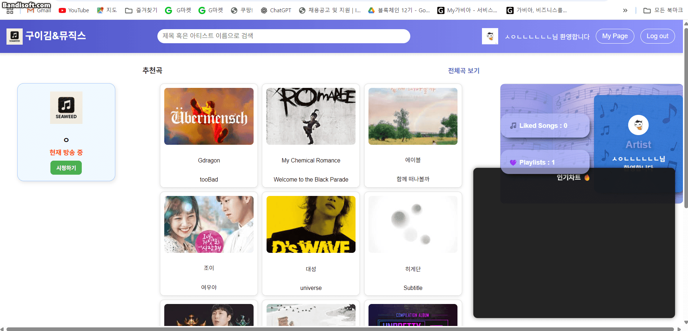
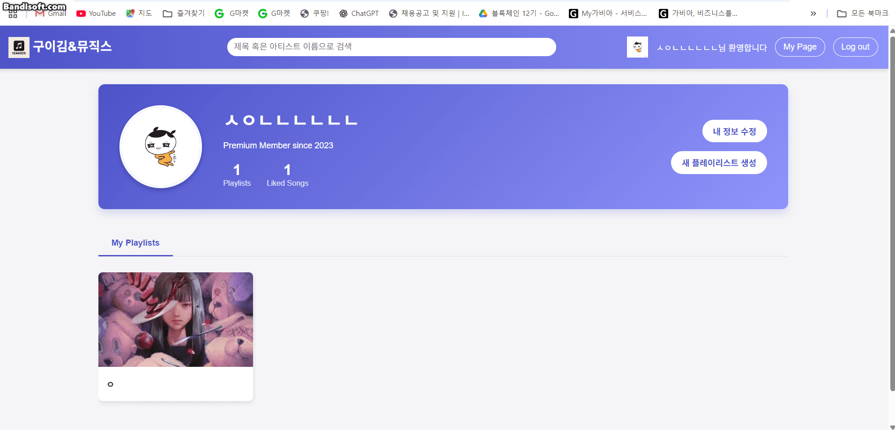
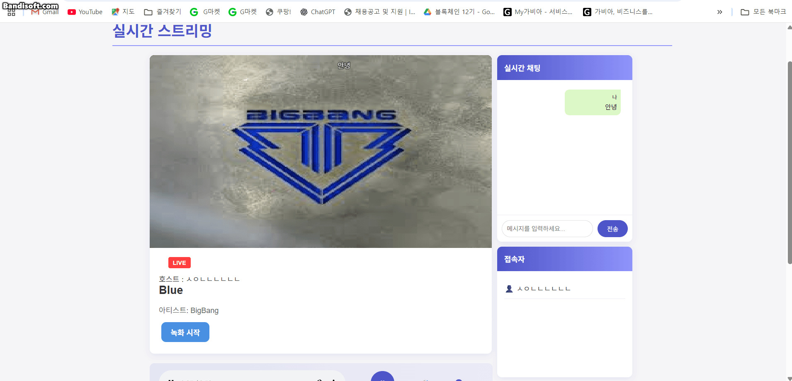

# 구이김 라이브스트리밍 사이트 회고

https://react01.shop/

## 목차

| 번호                            | 항목 이름               |
| ------------------------------- | ----------------------- |
| [1](#1-역할-및-담당-기능)       | 역할 및 담당 기능       |
| [2](#2-api-문서)                | api 문서                |
| [3](#3-구현한-기능-상세)        | 구현한 기능 상세        |
| [4](#4-기술적으로-새로-배운-점) | 기술적으로 새로 배운 점 |
| [5](#5-어려웠던-점과-해결-과정) | 어려웠던 점과 해결 과정 |
| [6](#6-협업-과정에서-느낀-점)   | 협업 과정에서 느낀 점   |
| [7](#7-전체-회고-및-느낀-점)    | 전체 회고 및 느낀 점    |

---

## 1. 역할 및 담당 기능

이번 프로젝트에서 마이페이지에서 필요한 기능 개발을 담당했습니다.

> - 유저 정보 수정
> - 새 플레이리스트 생성, 삭제
> - 플레이리스트 상세 팝업
> - 플레이리스트 곡 추가, 삭제

---

## 2. API 문서

### 음악 관련

| Method | URL                    | 설명                                                  |
| ------ | ---------------------- | ----------------------------------------------------- |
| `GET`  | `/`                    | 전체 음악 리스트 랜덤 12곡 조회 및 메인 페이지 렌더링 |
| `GET`  | `/music/:id`           | 특정 음악 상세 정보 및 좋아요 여부 조회               |
| `POST` | `/music/:id/like`      | 특정 음악 좋아요 토글 처리                            |
| `GET`  | `/music/:id/likecheck` | 유저가 특정 음악에 좋아요 했는지 여부 확인            |
| `GET`  | `/music/playlist/list` | 로그인된 유저의 모든 플레이리스트 조회                |

---

### 유저 관련

| Method | URL               | 설명                                |
| ------ | ----------------- | ----------------------------------- |
| `GET`  | `/login`          | 카카오 로그인 페이지로 리다이렉트   |
| `GET`  | `/logout`         | 쿠키 제거 후 로그아웃 처리          |
| `GET`  | `/kakao/callback` | 카카오 로그인 콜백 처리 후 JWT 발급 |
| `POST` | `/updateProfile`  | 프로필 이미지 및 닉네임 수정        |

---

### 플레이리스트 관련

| Method | URL                         | 설명                                          |
| ------ | --------------------------- | --------------------------------------------- |
| `GET`  | `/mypage`                   | 마이페이지 렌더링 및 유저별 플레이리스트 조회 |
| `GET`  | `/mypage/getPlaylistByName` | 특정 이름의 플레이리스트 조회                 |
| `POST` | `/createPlaylist`           | 새로운 플레이리스트 생성 (곡 포함)            |
| `POST` | `/addSongToPlaylist`        | 기존 플레이리스트에 곡 추가                   |
| `POST` | `/deletePlaylist`           | 플레이리스트 전체 삭제                        |
| `POST` | `/deleteSongFromPlaylist`   | 플레이리스트에서 특정 곡 삭제                 |

---

### 실시간 스트리밍 관련

| Method | URL                                 | 설명                                                   |
| ------ | ----------------------------------- | ------------------------------------------------------ |
| `GET`  | `/live?playlistName=...`            | 라이브 스트리밍 페이지 렌더링 및 녹화 영상 리스트 포함 |
| `GET`  | `/live/viewers?playlistName=...`    | 시청자용 라이브 접속 페이지 렌더링                     |
| `GET`  | `/live/replay/:videoId`             | 특정 녹화 영상 다시보기 페이지 렌더링                  |
| `GET`  | `/live/api/musiclist/:playlistName` | 플레이리스트에 포함된 음악 리스트 조회                 |
| `POST` | `/live/update`                      | 스트리밍 상태 변경 처리 (시작/종료)                    |

---

### 🔍 검색 기능

| Method | URL                    | 설명                                              |
| ------ | ---------------------- | ------------------------------------------------- |
| `GET`  | `/search?index=검색어` | 음악/게시글 등 검색 결과 조회 (페이지네이션 포함) |

---

## 3. 구현한 기능 상세

### 1. 유저 정보 수정

- 카카오 로그인 이후 유저의 닉네임과 프로필 이미지를 변경할 수 있습니다.

- 업데이트하려는 프로필 이미지의 미리보기를 표시합니다.

---

### 2. 플레이리스트 생성, 삭제

- `플레이리스트 생성` 버튼을 눌러 플레이리스트 이름을 입력하고 원하는 곡을 추가합니다.

- `곡 추가` 버튼을 눌러 검색창에 제목 혹은 아티스트 명을 입력하여 원하는 곡을 찾아 추가합니다.

- 생성 과정에서 발생하는 알림 메시지를 toast로 구현했습니다.

---

### 3. 플레이리스트 곡 추가, 삭제

- 생성된 플레이리스트의 상세 팝업에서 재생, 곡 추가/삭제, 스트리밍 시작 작업이 가능합니다.

- 플레이리스트의 마지막 곡을 삭제하는 경우, 플레이리스트가 함께 삭제됩니다.

---

## 4. 기술적으로 새로 배운 점

### FormData와 파일 업로드 처리

- **클라이언트 측**: `FormData`를 사용한 파일과 텍스트 데이터의 동시 전송
- **서버 측**: `multer` 미들웨어를 활용한 `multipart/form-data` 처리
- 프로필 이미지 업로드 시 미리보기 기능 구현으로 사용자 경험 개선

### EJS 템플릿 엔진 활용

- `<%- include %>` 문법을 통한 공통 컴포넌트(header) 재사용
- 서버에서 전달받은 데이터를 `<%= %>` 문법으로 안전하게 렌더링
- HTML 구조 설계 시 태그 중첩과 닫기 태그 관리의 중요성 체감

### JWT 기반 인증 시스템

- 쿠키에 저장된 JWT 토큰을 미들웨어에서 검증하는 과정 구현
- `jwt.verify()`를 통한 토큰 유효성 검사 및 사용자 정보 추출
- 환경변수(`JWT_SECRET_KEY`) 관리의 중요성과 보안 고려사항

### 실시간 UI 피드백 시스템

- Toast 메시지를 통한 사용자 액션에 대한 즉각적인 피드백 제공
- 성공/실패 상황에 따른 다른 스타일의 알림 메시지 구현
- `setTimeout`을 활용한 자동 사라지는 알림 기능

### Axios를 활용한 비동기 통신

- CDN을 통한 외부 라이브러리 로드 방법 학습
- Promise 기반의 HTTP 요청 처리 및 에러 핸들링
- 검색 기능에서 실시간 API 호출과 결과 렌더링

---

## 5. 어려웠던 점과 해결 과정

### HTML 구조 충돌 문제

**문제**: `header.ejs`에 완전한 HTML 구조(`<html>`, `<head>`, `<body>`)가 포함되어, `myPage.ejs`에 include할 때 중복된 구조로 인해 렌더링 오류 발생

**해결 과정**:

- 브라우저 개발자 도구에서 실제 렌더링된 HTML 구조 분석
- `header.ejs`를 순수한 `<header>` 컴포넌트로 리팩토링
- include하는 파일과 포함되는 파일 간의 역할 분담 명확화

### JWT 토큰 검증 실패

**문제**: `process.env.JWT_SECRET_KEY`가 `undefined`로 인한 토큰 검증 에러

**해결 과정**:

- `.env` 파일 설정 확인 및 `dotenv` 로드 순서 점검
- 미들웨어에서 환경변수 존재 여부 사전 검증 로직 추가
- try-catch를 통한 토큰 검증 실패 시 적절한 fallback 처리

### 파일 업로드 관련 에러

**문제**: `multipart/form-data` 요청이 서버에서 제대로 처리되지 않는 문제

**해결 과정**:

- `multer` 미들웨어 설정 및 라우터 연결 순서 재점검
- 클라이언트에서 `FormData` 생성 시 올바른 필드명 사용 확인
- 파일이 선택되지 않은 경우에 대한 예외 처리 추가

### 비동기 데이터 처리와 UI 동기화

**문제**: 플레이리스트 생성/삭제 후 화면이 즉시 업데이트되지 않는 문제

**해결 과정**:

- 서버 응답 완료 후 DOM 직접 조작을 통한 실시간 UI 반영
- 성공/실패에 따른 적절한 사용자 피드백 메시지 표시
- `async/await` 패턴으로 비동기 흐름 명확화

### CORS 및 정적 파일 경로 문제

**문제**: 개발 환경과 배포 환경에서 정적 파일 경로 차이로 인한 리소스 로드 실패

**해결 과정**:

- Express 정적 파일 제공 설정(`app.use(express.static())`) 점검
- 상대 경로와 절대 경로 사용 기준 정립
- 배포 환경에서의 파일 구조와 URL 매핑 관계 이해

---

## 6. 협업 과정에서 느낀 점

- 실시간 기능을 구현하면서 느낀 가장 중요한 점은
  백엔드와 프론트 간의 긴밀한 소통과 데이터 흐름 이해가 필수적이라는 것이었습니다.

- 처음에는 각자 맡은 기능을 완성하면 전체 흐름이 자연스럽게 이어질 거라 생각했지만,
  실시간 스트리밍, 채팅, 재생 상태 관리 등 복잡한 데이터 흐름을 다루면서
  모든 팀원이 기능 간 연동을 지속적으로 공유하고 조율해야 한다는 것을 절실히 깨달았습니다.

- 협업 도구 측면에서는
  **브랜치 전략(dev → main 병합)**과 PR 리뷰 과정을 직접 경험하면서
  GitHub의 사용 방식에 익숙해질 수 있었고,
  병합 시 발생하는 충돌과 오류를 직접 해결해보는 실전 경험도 할 수 있었습니다.

- 또한, 배포 환경에서는 로컬에서 발생하지 않았던 에러들이 자주 발생했습니다.
  이는 운영 환경과 개발 환경의 차이 때문이었고,
  그 과정에서 배포 전 충분한 테스트와 디버깅의 중요성을 깊이 있게 체감했습니다.

---

## 7. 전체 회고 및 느낀 점

- 사용자 입장에서 기능이 어떻게 작동해야 하는지를 고민하며 개발했던 것이 인상 깊었습니다.
- 기술적인 성장뿐 아니라 팀원과 함께 문제를 해결해나가는 협업 방식 자체가 가장 큰 배움이었습니다.
