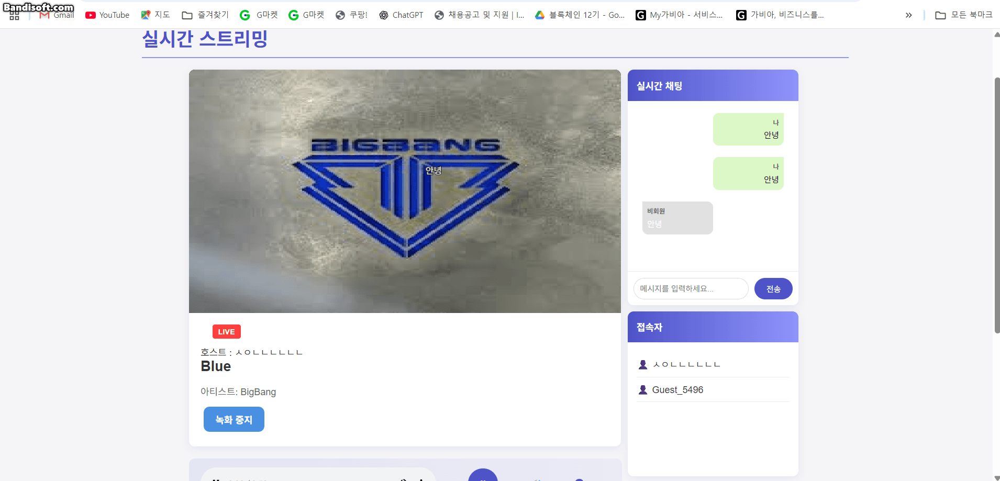
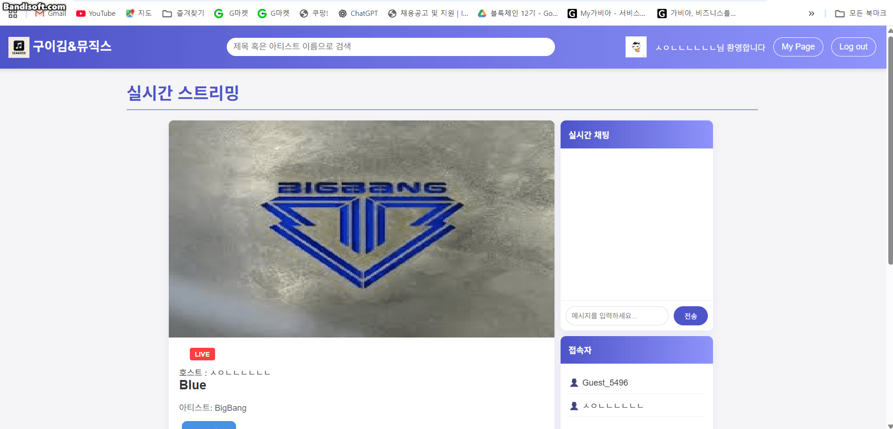

# 구이김 라이브스트리밍 사이트 회고록

## 목차

| 번호                            | 항목 이름               |
| ------------------------------- | ----------------------- |
| [1](#1-역할-및-담당-기능)       | 역할 및 담당 기능       |
| [2](#2-api-문서)                | api 문서                |
| [3](#3-구현한-기능-상세)        | 구현한 기능 상세        |
| [4](#4-기술적으로-새로-배운-점) | 기술적으로 새로 배운 점 |
| [5](#5-어려웠던-점과-해결-과정) | 어려웠던 점과 해결 과정 |
| [6](#6-협업-과정에서-느낀-점)   | 협업 과정에서 느낀 점   |
| [7](#7-전체-회고-및-느낀-점)    | 전체 회고 및 느낀 점    |

---

## 1. 역할 및 담당 기능

이번 프로젝트에서 실시간 스트리밍 페이지와 검색 페이지 개발을 중심으로, 연속 재생, 실시간 채팅, 녹화 기능, 스트리밍 상태 관리(라이브/종료), 음악 이름 및 아티스트 검색 등의 기능을 담당했습니다.

---

## 2. API 문서

### 음악 관련

| Method | URL                    | 설명                                                  |
| ------ | ---------------------- | ----------------------------------------------------- |
| `GET`  | `/`                    | 전체 음악 리스트 랜덤 12곡 조회 및 메인 페이지 렌더링 |
| `GET`  | `/music/:id`           | 특정 음악 상세 정보 및 좋아요 여부 조회               |
| `POST` | `/music/:id/like`      | 특정 음악 좋아요 토글 처리                            |
| `GET`  | `/music/:id/likecheck` | 유저가 특정 음악에 좋아요 했는지 여부 확인            |
| `GET`  | `/music/playlist/list` | 로그인된 유저의 모든 플레이리스트 조회                |

---

### 유저 관련

| Method | URL               | 설명                                |
| ------ | ----------------- | ----------------------------------- |
| `GET`  | `/login`          | 카카오 로그인 페이지로 리다이렉트   |
| `GET`  | `/logout`         | 쿠키 제거 후 로그아웃 처리          |
| `GET`  | `/kakao/callback` | 카카오 로그인 콜백 처리 후 JWT 발급 |
| `POST` | `/updateProfile`  | 프로필 이미지 및 닉네임 수정        |

---

### 플레이리스트 관련

| Method | URL                         | 설명                                          |
| ------ | --------------------------- | --------------------------------------------- |
| `GET`  | `/mypage`                   | 마이페이지 렌더링 및 유저별 플레이리스트 조회 |
| `GET`  | `/mypage/getPlaylistByName` | 특정 이름의 플레이리스트 조회                 |
| `POST` | `/createPlaylist`           | 새로운 플레이리스트 생성 (곡 포함)            |
| `POST` | `/addSongToPlaylist`        | 기존 플레이리스트에 곡 추가                   |
| `POST` | `/deletePlaylist`           | 플레이리스트 전체 삭제                        |
| `POST` | `/deleteSongFromPlaylist`   | 플레이리스트에서 특정 곡 삭제                 |

---

### 실시간 스트리밍 관련

| Method | URL                                 | 설명                                                   |
| ------ | ----------------------------------- | ------------------------------------------------------ |
| `GET`  | `/live?playlistName=...`            | 라이브 스트리밍 페이지 렌더링 및 녹화 영상 리스트 포함 |
| `GET`  | `/live/viewers?playlistName=...`    | 시청자용 라이브 접속 페이지 렌더링                     |
| `GET`  | `/live/replay/:videoId`             | 특정 녹화 영상 다시보기 페이지 렌더링                  |
| `GET`  | `/live/api/musiclist/:playlistName` | 플레이리스트에 포함된 음악 리스트 조회                 |
| `POST` | `/live/update`                      | 스트리밍 상태 변경 처리 (시작/종료)                    |

---

### 🔍 검색 기능

| Method | URL                    | 설명                                              |
| ------ | ---------------------- | ------------------------------------------------- |
| `GET`  | `/search?index=검색어` | 음악/게시글 등 검색 결과 조회 (페이지네이션 포함) |

---

## 3. 구현한 기능 상세

### 1. 검색 페이지

- 사용자가 원하는 노래 제목이나 아티스트 이름을 검색하여 즉시 음악을 찾아 들을 수 있습니다.

- 검색 결과는 자동 필터링되어 빠르게 원하는 곡을 확인하고 재생할 수 있습니다.

---

### 2. 스트리밍 페이지 접속

- 마이페이지에서 생성한 플레이리스트에서 스트리밍 버튼을 누르면,
  해당 곡들을 기반으로 스트리밍 페이지로 이동하게 됩니다.

- 이 기능은 스트리머 전용 기능이며, 일반 시청자는 사용할 수 없습니다.

---

### 3. 녹화 시작

- 스트리머가 녹화 버튼을 클릭하면, 방송이 자동으로 녹화되며
  동시에 메인페이지에 실시간 방송으로 등록되어 다른 사용자에게 노출됩니다.

- 녹화 중에는 음악, 영상, 채팅 화면이 함께 저장됩니다.

- 이 기능 역시 스트리머만 사용할 수 있습니다.

---

### 4. 시청자 페이지 접속 및 실시간 채팅

- 일반 시청자는 메인페이지에서 실시간 방송 리스트를 통해 접속할 수 있습니다.

- 접속 후 채팅을 입력하면, 그 메시지가 스트리밍 화면 상단에 실시간으로 표시됩니다.

- 실시간으로 음악을 감상하며 다른 시청자들과 함께 소통할 수 있습니다.

---

### 5. 다시보기 영상 확인

- 스트리밍이 종료되면, 방송 내용이 자동으로 다시보기 페이지에 저장됩니다.

- 다시보기에서는 당시 방송되었던 영상, 음악, 채팅 내용을 그대로 재생할 수 있으며
- 실시간으로 입력되었던 채팅 메시지들도 화면에 그대로 남아 있어 소통 내용을 복습할 수 있습니다.

---

- 실시간 스트리밍 페이지 구성 (호스트 / 시청자 페이지 구분)
- webRTC를 이용한 음악과 영상 실시간 스트리밍 구현
- Socket.io 기반 실시간 채팅 구현
- 채팅을 Canvas 위에 띄우는 UI 구현
- MediaRecorder API를 활용한 라이브 녹화 기능
- 녹화 종료 시 영상 저장 및 다시보기 기능 구현
- 플레이리스트 연속 재생 로직 구현

---

## 4. 기술적으로 새로 배운 점

- WebSocket의 기본 원리와 socket.io 사용 방법
- MediaRecorder를 사용해 브라우저에서 직접 영상 녹화 및 Blob 저장
- Canvas에 실시간으로 텍스트(댓글)를 띄우는 처리
- 클라이언트에서 생성한 비디오 파일을 서버에 저장하는 전체 흐름
- 클라이언트 간 역할(호스트/시청자) 분기 처리

---

## 5. 어려웠던 점과 해결 과정

- 처음에는 Canvas와 Socket.io만을 활용해 음악 스트리밍과 채팅을 동시에 구현하려고 했습니다.
  하지만 음악과 영상을 동시에 실시간으로 처리하는 과정에서 여러 가지 기술적 제약을 마주하게 되었고,
  하드코딩 방식으로 접근하더라도 끊김, 싱크 오류, 데이터량 문제 등으로 인해 원활한 스트리밍이 불가능하다는 점을 느꼈습니다.

- 그러던 중 WebRTC라는 실시간 통신 기술을 알게 되었고,
  이 기술이 저지연 실시간 스트리밍에 최적화되어 있다는 점에서 현재 요구사항에 적합하다는 판단을 내렸습니다.
  이후 WebRTC에 대한 개념과 구현 방식을 학습하며, 기존 구조를 WebRTC 기반으로 재구성하여
  노래와 화면을 함께 전송하는 실시간 음악 스트리밍 기능을 성공적으로 구현할 수 있었습니다.

---

## 6. 협업 과정에서 느낀 점

- 실시간 기능을 구현하면서 느낀 가장 중요한 점은
  백엔드와 프론트 간의 긴밀한 소통과 데이터 흐름 이해가 필수적이라는 것이었습니다.

- 처음에는 각자 맡은 기능을 완성하면 전체 흐름이 자연스럽게 이어질 거라 생각했지만,
  실시간 스트리밍, 채팅, 재생 상태 관리 등 복잡한 데이터 흐름을 다루면서
  모든 팀원이 기능 간 연동을 지속적으로 공유하고 조율해야 한다는 것을 절실히 깨달았습니다.

- 협업 도구 측면에서는
  **브랜치 전략(dev → main 병합)**과 PR 리뷰 과정을 직접 경험하면서
  GitHub의 사용 방식에 익숙해질 수 있었고,
  병합 시 발생하는 충돌과 오류를 직접 해결해보는 실전 경험도 할 수 있었습니다.

- 또한, 배포 환경에서는 로컬에서 발생하지 않았던 에러들이 자주 발생했습니다.
  이는 운영 환경과 개발 환경의 차이 때문이었고,
  그 과정에서 배포 전 충분한 테스트와 디버깅의 중요성을 깊이 있게 체감했습니다.

---

## 7. 전체 회고 및 느낀 점

- 실시간 채팅, 스트리밍, 녹화라는 복잡한 기능을 직접 구현해보며 다양한 웹 기술을 경험할 수 있었습니다.
- 사용자 입장에서 기능이 어떻게 작동해야 하는지를 고민하며 개발했던 것이 인상 깊었습니다.
- 기술적인 성장뿐 아니라 팀원과 함께 문제를 해결해나가는 협업 방식 자체가 가장 큰 배움이었습니다.
